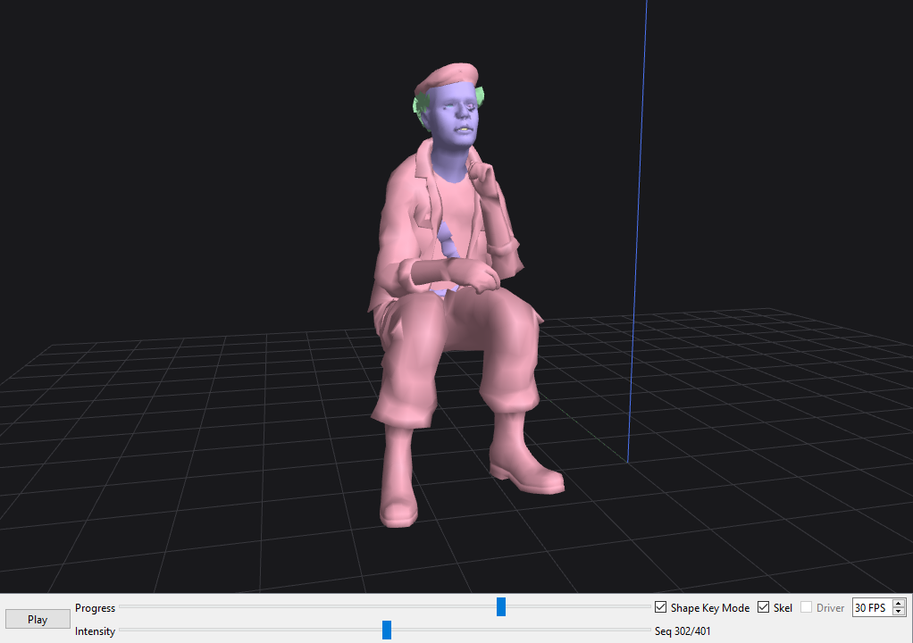

# Source Model Viewer

A Python 3D viewer for Source engine models.

## Features

* **Models** | Supports SMD, DMX and VTA model assets.
* **Controls** | Controls for animation sequences and flex shapes.

## Packages

* **numpy** | For model optimization.
* **PySide6** | For the program interface.
* **PyOpenGL** | For rendering.